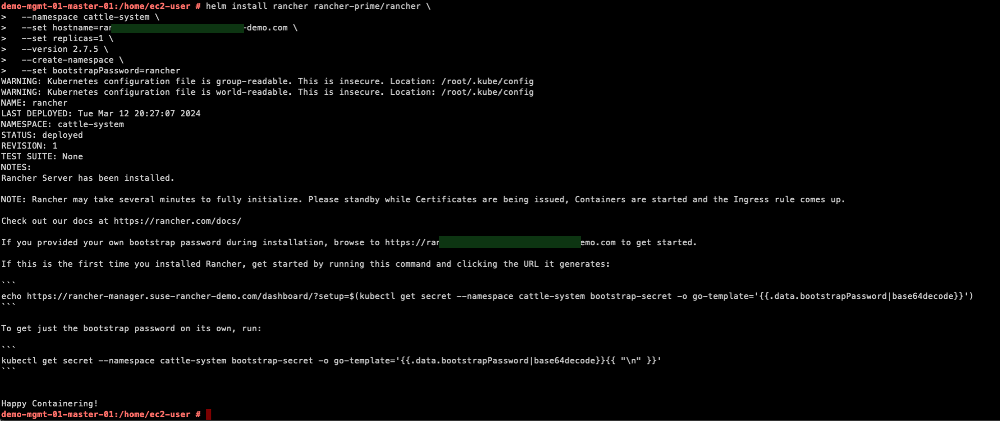

# Rancher Prime Manager Deployment - With Self-Signed Certificate and Direct Internet Access

This Page is created to provide the reader with a step-by-step guid on deploying **Rancher Prime** Manager with Self-Signed Certificate considering direct internet access to **Rancher Prime** Manager.

---

<p align="center">
    
</p>

---

## Overview

Please follow the below steps before installing Rancher Prime Server

> Kubernetes Cluster

This page will provide you with the step-by-step guide on installing Rancher on a kubernetes cluster. Installing the kubernetes cluster will not be covered in this page. For a guide on installing a supported kubernetes cluster, please choose from the list below and follow the steps provided in the link for each kubernetes distribution. Please make sure you have chosen a supported version of a kubernetes cluster and OS. For more info, please refer to the support matrix in [this link](https://www.suse.com/suse-rancher/support-matrix/all-supported-versions/rancher-v2-8-2/)
- RKE: Please refer to [this page](https://ranchermanager.docs.rancher.com/how-to-guides/new-user-guides/infrastructure-setup/ha-rke1-kubernetes-cluster).
- K3s: Please refer to [this page](https://ranchermanager.docs.rancher.com/how-to-guides/new-user-guides/infrastructure-setup/ha-k3s-kubernetes-cluster).
- RKE2: Please refer to [this page](https://ranchermanager.docs.rancher.com/how-to-guides/new-user-guides/infrastructure-setup/ha-rke2-kubernetes-cluster).
- EKS: Please refer to [this page](https://ranchermanager.docs.rancher.com/getting-started/installation-and-upgrade/install-upgrade-on-a-kubernetes-cluster/rancher-on-amazon-eks).
- AKS: Please refer to [this page](https://ranchermanager.docs.rancher.com/getting-started/installation-and-upgrade/install-upgrade-on-a-kubernetes-cluster/rancher-on-aks).
- GKE: Please refer to [this page](https://ranchermanager.docs.rancher.com/getting-started/installation-and-upgrade/install-upgrade-on-a-kubernetes-cluster/rancher-on-gke). Please Note: GKE has two modes of operation when creating a Kubernetes cluster, Autopilot and Standard mode. The cluster configuration for Autopilot mode has restrictions on editing the kube-system namespace. However, Rancher needs to create resources in the kube-system namespace during installation. As a result, you will not be able to install Rancher on a GKE cluster created in Autopilot mode.

> Installation Requirements 

Please make sure that you have followed the installation requirements provided in [this link](/README.md#installation-requirements)

> Helm 3

The deployment of Rancher and other components will be done using Helm. So it is required to have helm installed on the server you are going to use to deploy Rancher from. To install helm, use the below command:

```bash
curl https://raw.githubusercontent.com/helm/helm/master/scripts/get-helm-3 | bash
```

> Cert Manager

First thing to do is to deploy cert manager. When used to deploy Rancher, it gives the option to automatically generate and rotate self-signed or Let’s Encrypt signed certificates. It is recommended to deploy Cert Manager using Helm Chart. Cert Manager requires a CDR (CustomResourceDefinition) to be installed before installing Cert manager. It is possible to force the installation of the CDR while installing Cert Manager using Helm by specifying the option `--set installCRDs=true`.

---

## Step-By-Step Guide

Once you have created a supported kubernetes cluster and installed Helm on it, please follow the below steps

> Install Cert Manager

```bash
# Add Cert manager Helm Repo
helm repo add jetstack https://charts.jetstack.io
```

---

<p align="center">
    
</p>

---

```bash
# Update Helm repository
helm repo update
```

---

<p align="center">
    
</p>

---

```bash
# Install Cert Manager version 1.11.0 and force the creation of a dedicated namespace and CDRs
helm install \
  cert-manager jetstack/cert-manager \
  --namespace cert-manager \
  --version v1.11.0 \
  --set installCRDs=true \
  --create-namespace
```

---

<p align="center">
    
</p>

---

> Check the deployment of the Cert Manager

```bash
# Check the rollout status of the deployment
kubectl -n cert-manager rollout status deploy/cert-manager
# Check the Pods in the Deployment
kubectl -n cert-manager get deployments
```

---

<p align="center">
    
</p>

---

> Deploy Rancher with Self-Signed Certificate

```bash
# Add Rancher Prime Helm Repo
helm repo add rancher-prime https://charts.rancher.com/server-charts/prime
```

---

<p align="center">
    
</p>

---

```bash
# Update Helm repository
helm repo update
```

---

<p align="center">
    
</p>

---

```bash
# Install Rancher Prime Manager version 2.6.5 with one replica and a bootstrap password of rancher and force the creation of a dedicated namespace
helm install rancher rancher-prime/rancher \
  --namespace cattle-system \
  --set hostname=<rancher-manager-fqdn> \
  --set replicas=1 \
  --version 2.7.5 \
  --create-namespace \
  --set bootstrapPassword=rancher
```

---

<p align="center">
    
</p>

---

> Check the deployment of the Rancher Prime

```bash
# Check the Pods in the Deployment
kubectl -n cattle-system get deployments
```

---

<p align="center">
    
</p>

---

> Check Rancher Prime Manager UI responsiveness

```bash
while true; do curl -kv https://<rancher-manager-fqdn> 2>&1 | grep -q "dynamiclistener-ca"; if [ $? != 0 ]; then echo "Rancher Prime Manager UI is not responsive yet"; sleep 5; continue; fi; break; done; echo "Rancher Prime Manager UI is now responsive, Your Rancher Deployment is Ready";
```

---

<p align="center">
    
</p>

---

> Login to Rancher Manager

Open your web browser and go to https://<rancher-manager-fqdn> and use the password we have set in the bootstrap option with helm 

---

<p align="center">
    
</p>

---

Start using Rancher

---

<p align="center">
    
</p>

---

**Enjoy** :blush: