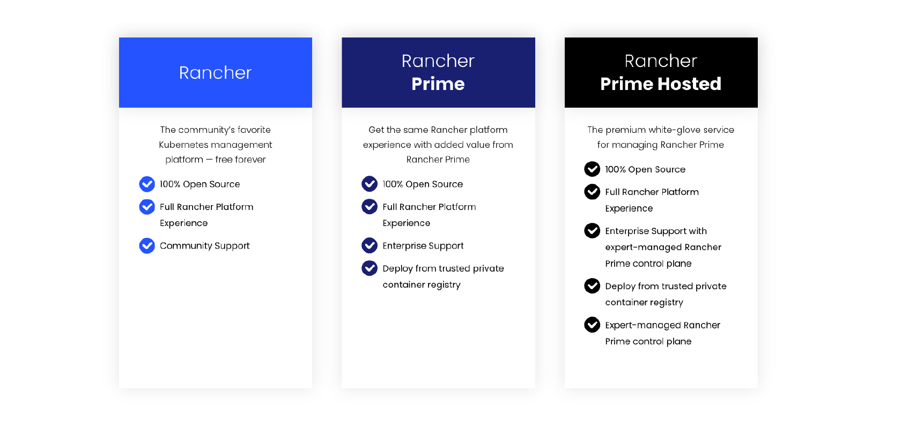
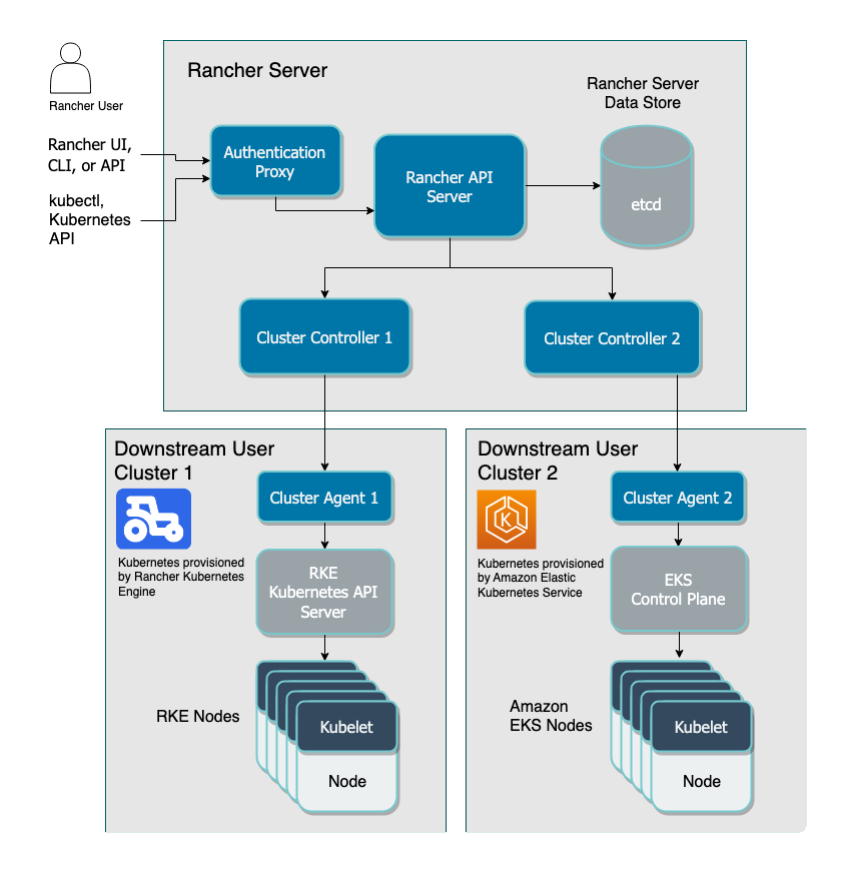

# Rancher Prime Manager - Deployment and Installation

This repo is created to provide the reader all the required information on deploying and installing _**Rancher Prime**_ manager on your kubernetes environment. The information provided in this repo will include, but not limited to, the kubernetes requirements, software requirements, network requirements and more. This repo will also provide the reader with a step-by-step guide for deploying _**Rancher Prime**_ Manager with the different supported methods of deployments.

---

    

---

## Overview

Rancher is a container management platform built for organizations that deploy containers in production. Rancher makes it easy to run Kubernetes everywhere, meet IT requirements, and empower DevOps teams. Rancher Manager provides multi-cluster management and lCM [lifecycle Management] across multiple infrastructure and multi-cloud. It also provides the DevOps teams with integrated tools for running containerized workload. With Rancher, you can deploy and manage not only kubernetes clusters but also containerized applications.

Rancher is a Kubernetes management tool to deploy and run clusters anywhere and on any provider.
Rancher can provision Kubernetes from a hosted provider, provision compute nodes and then install Kubernetes onto them, or import existing Kubernetes clusters running anywhere.

Rancher adds significant value on top of Kubernetes, first by centralizing authentication and role-based access control (RBAC) for all of the clusters, giving global admins the ability to control cluster access from one location.

It then enables detailed monitoring and alerting for clusters and their resources, ships logs to external providers, and integrates directly with Helm via the Application Catalog. If you have an external CI/CD system, you can plug it into Rancher, but if you don't, Rancher even includes Fleet to help you automatically deploy and upgrade workloads.

Rancher comes in 3 different flavours - Rancher (Community), _**Rancher Prime**_, and **Rancher Hosted**. Rancher v2.7 introduces _**Rancher Prime**_, an evolution of the Rancher enterprise offering. _**Rancher Prime**_ is a new edition of the commercial, enterprise offering built on the the same source code. Rancher’s product will therefore continue to be 100% open source with additional value coming in from security assurances, extended lifecycle, access to focused architectures and Kubernetes advisories. _**Rancher Prime**_ will also offer options to get production support for innovative Rancher projects. With _**Rancher Prime**_, installation assets are hosted on a trusted registry owned and managed by Rancher. For a detailed comparison, please refer to [this link](https://www.rancher.com/products/rancher-platform)

---

    

---

Rancher Manager is an enterprise ready, production-level Kubernetes management platform that is deployed as a container running on a kubernetes cluster and is installed using Helm Charts. Rancher can be installed on any Kubernetes cluster. This cluster can use upstream Kubernetes, or it can use one of Rancher's Kubernetes distributions, or it can be a managed Kubernetes cluster from a provider such as Amazon EKS. For more info, please refer to [this link](https://ranchermanager.docs.rancher.com/getting-started/installation-and-upgrade/install-upgrade-on-a-kubernetes-cluster#kubernetes-cluster).

Rancher is installed using the Helm package manager for Kubernetes. Helm charts provide template syntax for Kubernetes YAML manifest documents. With Helm, we can create configurable deployments instead of just using static files.

Rancher can be installed in any of the below options:
- Single Node Kubernetes Cluster [Not Recommended]
- High-Availability Kubernetes cluster [Recommended]
- Rancher on EKS Install with the AWS Marketplace
- Docker Install [For Testing and Demonstration ONLY]

In each of the mentioned options above, it is expected to have a direct internet access to the Rancher Manager, however, Rancher also support an AirGapped Environment as well as being deployed behind an HTTP proxy. Please note that there are additional consideration that need to be taken care of before the installation.

---

## Rancher Manager High-Level Architecture Overview

Rancher Manager is deployed as a container on top of a kubernetes cluster. For the best performance and security, it is recommended to have a dedicated Kubernetes cluster for the Rancher management server. Running user workloads on this cluster is not advised. Also, a high-availability Kubernetes cluster (3 Master Nodes, 3 Worker Nodes) is recommended for production.

The majority of Rancher 2.x software runs on the Rancher Server/Manager. Rancher Server/Manager includes all the software components used to manage the entire Rancher deployment. The Rancher manager will be deployed on a dedicated kubernetes cluster (we can call it the management cluster) and then other kubernetes cluster can be provisioned from or imported to Rancher Manager. Each downstream kubernetes cluster (Cluster provisioned by or imported to Rancher) will have a cluster agent running inside the cluster which will allow the communication between the Rancher Manager and the downstream cluster. 

The figure below illustrates the high-level architecture of Rancher 2.x. The figure depicts a Rancher Server installation that manages two downstream Kubernetes clusters: one created by RKE and another created by Amazon EKS (Elastic Kubernetes Service).

---

    

---

## Installation Requirements

To deploy and install Rancher Manager on a kubernetes cluster, several requirements must be available for a successful deployment. Since there are a high number of influencing factors that may vary over time, the requirements listed here should be understood as reasonable starting points that work well for most use cases. 

---

### Underlying Linux Operating System - Upstream Cluster - Management Cluster

All supported operating systems are 64-bit x86. Rancher should work with any modern Linux distribution. For ARM, installing Rancher on ARN is still under experimental, for more info, please refer to [this link](https://ranchermanager.docs.rancher.com/how-to-guides/advanced-user-guides/enable-experimental-features/rancher-on-arm64) 

Deploying Rancher is supported on more of the operating system available with their respective kubernetes distributions, the Rancher support matrix lists all the OS and Docker versions were tested for each Rancher version. For the support matrix, please refer to [this link](https://www.suse.com/suse-rancher/support-matrix/all-supported-versions?_gl=1*15eexfp*_ga*MjAyNzQzNTA0NC4xNzA5MTkxMTM2*_ga_Y7SFXF9L00*MTcxMDI1NTY2MC4xNS4xLjE3MTAyNjQyODUuNTMuMC4w)

Please Note:
- Docker is required for nodes that will run RKE clusters. It is not required for RKE2 or K3s clusters.
- The ntp (Network Time Protocol) package should be installed. This prevents errors with certificate validation that can occur when the time is not synchronized between the client and server.
- Some distributions of Linux may have default firewall rules that block communication within the Kubernetes cluster. Since Kubernetes v1.19, firewalld must be turned off, because it conflicts with the Kubernetes networking plugins.

---

### Kubernetes Cluster - Upstream Cluster - Management Cluster

Rancher can be installed on any type of kubernetes cluster, however, it is recommended to install it on the tested and supported kubernetes distribution type with respected to the version. Rancher is tested and supported on RKE, RKE2, K3S, EKS, AKS, GKE. For the supported version, please refer to the [support matrix](https://www.suse.com/suse-rancher/support-matrix/all-supported-versions/rancher-v2-8-2/).

Each kubernetes distribution may need a some different consideration to be taken care of. For example; Rancher requires an Ingress to be installed and in some cases require to have specific configuration on the ingress depending on the ingress type, however, RKE2 and K3S come with an ingress already deployed so no need to do any thing else for it. For a reference to all the supported and tested kubernetes distribution, please refer to [this link](https://ranchermanager.docs.rancher.com/getting-started/installation-and-upgrade/install-upgrade-on-a-kubernetes-cluster#kubernetes-cluster)

Please Note: If you install Rancher on a hardened Kubernetes cluster, check the [Exempting Required Rancher Namespaces section](https://ranchermanager.docs.rancher.com/how-to-guides/new-user-guides/authentication-permissions-and-global-configuration/psa-config-templates#exempting-required-rancher-namespaces) for detailed requirements.

---

### Hardware Requirements (Sizing) - Upstream Cluster - Management Cluster

To deploy Rancher on a kubernetes cluster, The following table lists a general minimum CPU and memory requirements for each node in the upstream cluster. This table is based on utilizing RKE, RKE2, K3S, and Hosted Kubernetes (EKS, AKS, GKS). For more info, please refer to [this link](https://ranchermanager.docs.rancher.com/getting-started/installation-and-upgrade/installation-requirements#hardware-requirements)

| Managed Infrastructure Size | Maximum Number of Clusters | Maximum Number of Nodes | vCPUs | RAM |
|:--------------------------: | :------------------------: | :---------------------: | :---: | :-: |
| Small	| 150 | 1500 | 4 | 16 GB |
| Medium | 300 | 3000 | 8 | 32 GB |
| Large | 500 | 5000 | 16 | 64 GB |

Please Note: for the large deployment, it is required to follow the best practices found in [this link](https://ranchermanager.docs.rancher.com/reference-guides/best-practices/rancher-server/tuning-and-best-practices-for-rancher-at-scale)

---

### Networking - Upstream Cluster - Management Cluster

Each node used should have a static IP configured, regardless of whether you are installing Rancher on a single node or on an HA cluster. In case of DHCP, each node should have a DHCP reservation to make sure the node gets the same IP allocated.

To operate properly, Rancher requires a number of ports to be open on Rancher nodes and on downstream Kubernetes cluster nodes. for the list of required ports on the upstream and downstream clusters depending on the kubernetes distribution used, please refer to [this link](https://ranchermanager.docs.rancher.com/getting-started/installation-and-upgrade/installation-requirements/port-requirements)

---

### Disk - Upstream Cluster - Management Cluster

Rancher performance depends on etcd in the cluster performance. To ensure optimal speed, we recommend always using SSD disks to back your Rancher management Kubernetes cluster. On cloud providers, you will also want to use the minimum size that allows the maximum IOPS. In larger clusters, consider using dedicated storage devices for etcd data and wal directories.

---

## References:
- [Rancher Prime Platform](https://www.rancher.com/products/rancher-platform)
- [Rancher Documentation - Main Page](https://ranchermanager.docs.rancher.com/)
- [Rancher Architecture](https://ranchermanager.docs.rancher.com/reference-guides/rancher-manager-architecture)
- [Hardware Requirements](https://ranchermanager.docs.rancher.com/getting-started/installation-and-upgrade/installation-requirements#hardware-requirements)
- [Support Matrix](https://www.suse.com/suse-rancher/support-matrix/all-supported-versions/rancher-v2-8-2/)
- [Tips For Running Rancher](https://ranchermanager.docs.rancher.com/reference-guides/best-practices/rancher-server/tips-for-running-rancher)
- [Tunning and Best Practices for Rancher At Scale](https://ranchermanager.docs.rancher.com/reference-guides/best-practices/rancher-server/tuning-and-best-practices-for-rancher-at-scale)
- [Port Requirements](https://ranchermanager.docs.rancher.com/getting-started/installation-and-upgrade/installation-requirements/port-requirements)

---

**Enjoy** :blush:

