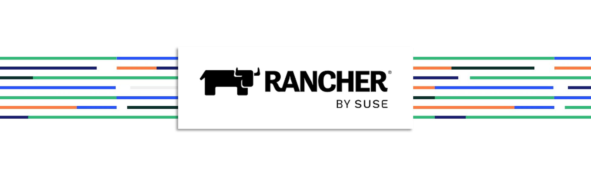

# Rancher Prime Manager - Deployment and Installation

Rancher is a container management platform built for organizations that deploy containers in production. Rancher makes it easy to run Kubernetes everywhere, meet IT requirements, and empower DevOps teams. Form more documentation on Rancher, please refer to [this link](https://ranchermanager.docs.rancher.com/). Rancher v2.7 introduces Rancher Prime, an evolution of the Rancher enterprise offering. Rancher Prime is a new edition of the commercial, enterprise offering built on the the same source code. Rancher’s product will therefore continue to be 100% open source with additional value coming in from security assurances, extended lifecycle, access to focused architectures and Kubernetes advisories. Rancher Prime will also offer options to get production support for innovative Rancher projects. With Rancher Prime, installation assets are hosted on a trusted registry owned and managed by Rancher.

This repo is created to provide the reader all the required information on deploying and installing **Rancher Prime** manager on your kubernetes environment. The information provided in this repo will include, but not limited to, the kubernetes requirements, software requirements, network requirements and more. This repo will also provide the reader with a step-by-step guide for deploying **Rancher Prime** Manager with the different supported methods of deployments.

---

    

---

## Overview

Rancher Server - or - Rancher Manager (same but different namings) is a kubernetes and container management platform deployed on a supported kubernetes cluster. Rancher Manager support the deployment over several kubernetes distribution such as RKE, RKE2, K3S, EKS, AKS, GKE. Rancher in general is a 100% Open Source solution that give you the ability to run the solution on your environment freely without any vendor locking. there are 3 different flavours of Rancher - Rancher (Community), Rancher Prime, and Rancher Hosted. All of the different flavours of Rancher have the same exact source code letting all different flavours provide the same core features. With **Rancher Prime** and **Rancher Hosted** additional services and support are provided. For a detailed comparison, please refer to [this link](https://www.rancher.com/products/rancher-platform)

---

    

---

## References:
- [Rancher Prime Platform](https://www.rancher.com/products/rancher-platform)
